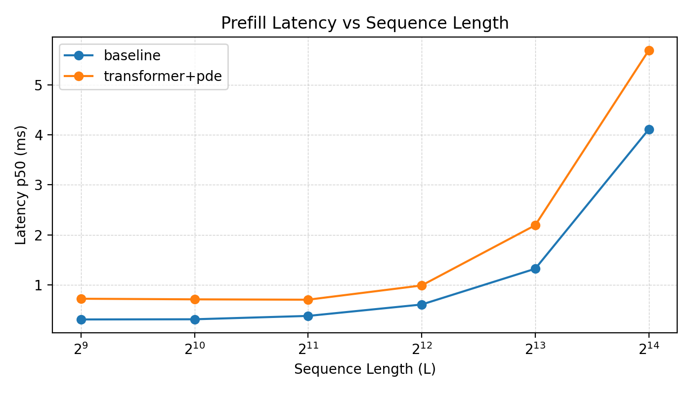

# Continuous-Time Attention: PDE-Guided Mechanisms for Long-Sequence Transformers

[](https://2025.emnlp.org/)
[](https://arxiv.org/abs/2505.20666)
[](https://aclanthology.org/2025.emnlp-main.1097.pdf)

Official PyTorch implementation of **Continuous-Time Attention**, a PDE-guided formulation of self-attention that treats token interactions as trajectories of a continuous-time dynamical system governed by partial differential equations.

## Portfolio Snapshot (Algorithm → Kernel → Serving)

This repo is intentionally maintained as an **algorithm-to-systems portfolio**: take a mathematically grounded token-mixing operator (PDE/stencil), implement it as a **fused Triton kernel**, and integrate it into a **vLLM serving stack** with end-to-end evidence.

- **Kernel (Triton fusion)**: multi-step fused diffusion stencil to reduce **HBM roundtrips** and **kernel launch overhead**.
- **Serving (vLLM integration)**: prefill/decode integration + scheduler/memory/telemetry knobs for controllable long-context serving.
- **Evidence-first**: scaling curves (latency/memory), profiler traces, and reproducible scripts.

### Reproduce (GPU)

```bash
# 0) Install PyTorch first (CPU/CUDA) following the official guide.
#    Examples:
#    - CPU-only:
#      pip install torch --index-url https://download.pytorch.org/whl/cpu
#    - CUDA (example; pick the right cuXX index for your machine):
#      pip install torch --index-url https://download.pytorch.org/whl/cu128
#
# Then install repo dependencies (everything except torch):
pip install -r src/requirements.txt

# Optional: vLLM integration (serving)
pip install vllm==0.13.0

# 1) System efficiency curves (prefill-style, forward-only)
python benchmarks/bench_block.py --device cuda --out_dir results/bench
python benchmarks/plot_system_efficiency.py --in_dir results/bench --out_dir assets/images

# 2) Profiler traces (where time goes: matmul vs stencil vs transpose)
python profiling/profile_pde.py --device cuda --out_dir profiling/out

# 3) vLLM end-to-end (baseline vs CTA; see serving/vllm)
bash serving/vllm/bench/run_all.sh
```

## System Diagram (High-Level Dataflow)


## Done Criteria (Engineering Deliverables)

- **Kernel**:
  - multi-step fused diffusion (`steps∈{2,4,8}`) completes in **one launch** and matches reference
  - wins vs non-fused in at least **two** of: total CUDA time / launch count / bandwidth trend
- **vLLM**:
  - one-command reproducible e2e numbers for **prefill latency / decode tokens/s / peak mem**
  - includes a **scheduler knob** (length threshold / steps policy) and **buffer pool** integration
  - provides trace evidence for stage-level attribution (attn vs CTA vs layout)

## System Pitch (Inference/Serving)

From a systems perspective, **Continuous-Time Attention (CTA)** can be viewed as a **local stencil token-mixing operator** (e.g., diffusion Laplacian) that refines token features across a pseudo-time axis. Each PDE refinement step is **\(O(L)\)** in sequence length and is **kernel-friendly** (regular memory access, fusable multi-step updates), making it a natural building block for **long-context prefill** pipelines.

This repo provides:

- **Research baseline**: PDE refinement layers integrated into Transformer blocks (`src/models/transformers.py`).
- **Systems evidence (this branch of work)**: microbenchmarks, profiling, and a Triton kernel stub to quantify/optimize **latency & memory scaling** for long sequences.

## System Efficiency (Prefill)

The following plots are generated from the scripts under `benchmarks/` (synthetic inputs, forward-only). They are meant to answer the serving question: **how does latency / peak memory scale with sequence length?**

- **Evidence snapshot (A800-80GB, bf16, B=1, D=512, heads=8, diffusion, steps=4)**:
  - **L=4096**: baseline p50 **0.607 ms** → transformer+pde p50 **0.988 ms** (**+0.381 ms**, ~**1.63×**)
  - **L=16384**: baseline p50 **4.108 ms** → transformer+pde p50 **5.688 ms** (**+1.58 ms**, ~**1.38×**)
  - **Peak memory (p95)**:
    - **L=4096**: baseline **48.0 MiB** → transformer+pde **63.1 MiB** (**+15.1 MiB**)
    - **L=16384**: baseline **143.2 MiB** → transformer+pde **207.1 MiB** (**+63.9 MiB**)

- **Latency vs Sequence Length**

  

- **Peak Memory vs Sequence Length**

  

Generate (GPU recommended):

```bash
# Install PyTorch first (CPU/CUDA), then:
pip install -r src/requirements.txt

# From repo root
python benchmarks/bench_block.py --device cuda --out_dir results/bench
python benchmarks/plot_system_efficiency.py --in_dir results/bench --out_dir assets/images
```

Tip: use `--pde_layout bld` to avoid transpose overhead, or `--pde_layout bdl`
to measure the layout cost explicitly.

## Microbenchmark

Two benchmark entrypoints:

- **PDE-only stencil cost** (isolates local operator cost):

```bash
python benchmarks/bench_pde_step.py --device cuda --out_dir results/bench
```

- **Block-level cost** (TransformerEncoderLayer + PDE refinement, includes transpose/layout overhead):

```bash
python benchmarks/bench_block.py --device cuda --out_dir results/bench
```

## Profiler Evidence

Use `torch.profiler` to capture traces and quantify where time/memory goes (matmul vs stencil vs transpose/layout):

```bash
python profiling/profile_pde.py --device cuda --out_dir profiling/out
```

Open the exported Chrome trace:

- `profiling/out/trace_*.json` (load in `chrome://tracing` or Perfetto)

Quick takeaways from the same setup as above (`mode=block, L=4096`):
- `cta_transformer_layer`: **~5.953 ms** self CUDA (Transformer work)
- `cta_pde_loop`: **~5.607 ms** self CUDA (PDE refinement loop)
- `cta_transpose_to_bdl` + `cta_transpose_to_bld`: **~0.554 ms** self CUDA total (layout overhead)

## Kernel Status

| Component | PyTorch | Triton | Notes |
|---|---:|---:|---|
| PDE diffusion (forward) | ✅ | ✅ | `kernels/diffusion_triton.py` provides an autotuned Triton kernel |
| PDE diffusion (backward) | ✅ | ✅ | Triton K3 backward kernel |
| PDE multi-step fusion | — | ✅ | Triton fused steps {2,4,8}; PyTorch uses loop |

## Serving Integration Roadmap

Target: long-context **prefill** acceleration and controllable token mixing in serving stacks.

- **Prefill-only integration**: apply PDE refinement after attention for long prompts; keep decode path unchanged.
- **Custom op route**: implement fused multi-step stencil as a custom op (Triton/CUDA) and call from PyTorch.
- **vLLM integration idea**: place PDE refinement as an optional post-attention mixing module inside the attention block (prefill path), with a kernel specialized for contiguous `[B, D, L]` layouts.

## Serving Evidence (vLLM)

Use the vLLM bench harness to produce baseline and CTA runs, then compare and plot:

```bash
# One-command end-to-end (repo-local tinyllama by default):
bash serving/vllm/bench/run_all.sh

# Or run each step manually:
python serving/vllm/bench/bench_vllm.py --help
python serving/vllm/bench/compare_vllm_bench.py --help
python serving/vllm/bench/plot_vllm_bench.py --help
python serving/vllm/bench/profile_vllm.py --help
```

Key artifacts:
- `results/serving/vllm/bench_vllm_baseline.csv` / `.json`
- `results/serving/vllm/bench_vllm_cta.csv` / `.json`
- `results/serving/vllm/compare_vllm_bench.md` / `.csv`
- `assets/images/vllm_cta_prefill_latency.png`
- `assets/images/vllm_cta_peak_mem.png`
- `results/serving/vllm/trace_vllm_baseline_prefill_tinyllama.json`
- `results/serving/vllm/trace_vllm_cta_prefill_tinyllama.json`

## Docs (Systems-Focused Notes)
- `docs/math_to_kernel.md`
- `docs/kernel_fusion_notes.md`
- `docs/vllm_serving_notes.md`

## 🌟 Overview

Continuous-Time Attention addresses the challenges of long-sequence modeling in Transformers by:

- 🔄 **PDE-Guided Dynamics**: Models token interactions as solutions of partial differential equations (PDEs) in continuous time
- 📈 **Improved Stability**: Better gradient flow and training stability for long-range dependencies  
- ⚡ **Efficient Computation**: Favorable computational properties for long sequences
- 🎯 **Strong Performance**: Consistent improvements across classification and language modeling tasks

## 📊 Key Results

| **Task** | **Standard Transformer** | **PDE-Transformer** | **Improvement** |
|----------|-------------------------|---------------------|----------------|
| IMDb | 59.4% | **62.4%** | +3.0% |
| AG News | 60.5% | **72.1%** | +11.6% |
| SST-2 | 56.6% | **76.3%** | +19.7% |
| IMDb (Char-level, LRA) | 64.68% | **65.44%** | +1.17% |

For WikiText-103 language modeling, PDE-Transformer achieves perplexity of **1.02** compared to Standard Longformer's **1.04** 

### Ablation Study Results

**Table: PDE Steps** - Optimal configuration uses **4 PDE steps**:
- 1 step: PPL = 3.49 (99.97% reduction)
- 2 steps: PPL = 3.42 (99.97% reduction)  
- **4 steps: PPL = 3.36** (99.97% reduction) ✓ **Best**
- 8 steps: Training becomes unstable

**Table: PDE Types** - All PDE variants achieve ~99.98% improvement:
- Diffusion (α=0.10): PPL = 2.15
- Wave (α=0.15): PPL = 2.27
- Reaction-Diffusion (α=0.10, β=0.02): PPL = 2.15
- Advection-Diffusion (α=0.10, β=0.03): PPL = 2.18

## 🚀 Quick Start

### Installation

```bash
# Clone the repository
git clone https://github.com/XueqingZhou/Continuous-Time-Attention.git
cd Continuous-Time-Attention

# (Recommended) create a venv
python -m venv .venv
source .venv/bin/activate
python -m pip install -U pip

# Install PyTorch (pick ONE of the following depending on your machine)
# CPU-only:
python -m pip install torch --index-url https://download.pytorch.org/whl/cpu
#
# CUDA (example; use the correct cuXX index for your driver/toolkit):
# python -m pip install torch --index-url https://download.pytorch.org/whl/cu128

# Install repo dependencies (everything except torch)
python -m pip install -r src/requirements.txt

# Run experiment scripts from `src/`
cd src
```

### Notes on large files (Git LFS / .gitignore)

- Generated artifacts such as `results/` and `profiling/out/` are ignored and should be reproduced via scripts.
- If you need to version model weights (e.g. `*.safetensors`), use Git LFS. This repo ships a `.gitattributes` with common weight patterns.
  - Quick start: `git lfs install` (then commit as usual; matching files go to LFS).

### Download Tokenizer

You'll need to download a pre-trained tokenizer (e.g., BERT tokenizer):

```python
from transformers import BertTokenizer

tokenizer = BertTokenizer.from_pretrained('bert-base-uncased')
tokenizer.save_pretrained('./tokenizer/bert-base-uncased')
```

### Run Experiments

#### 1. Classification Tasks (Table 1: IMDb, AG News, SST-2)

```bash
# IMDb
python experiments/run_classification.py \
    --dataset imdb \
    --tokenizer_path ./tokenizer/bert-base-uncased \
    --max_length 256 \
    --embed_dim 128 \
    --num_heads 4 \
    --hidden_dim 256 \
    --num_layers 2 \
    --pde_type diffusion \
    --pde_steps 1 \
    --batch_size 64 \
    --num_epochs 5 \
    --learning_rate 1e-4 \
    --output_dir results

# AG News
python experiments/run_classification.py \
    --dataset ag_news \
    --tokenizer_path ./tokenizer/bert-base-uncased \
    --max_length 256 \
    --batch_size 64 \
    --num_epochs 5 \
    --output_dir results

# SST-2
python experiments/run_classification.py \
    --dataset sst2 \
    --tokenizer_path ./tokenizer/bert-base-uncased \
    --max_length 128 \
    --batch_size 512 \
    --num_epochs 2 \
    --output_dir results
```

#### 2. Character-Level IMDb (Table 2: Long Range Arena)

```bash
python experiments/run_char_level.py \
    --max_length 2048 \
    --embed_dim 256 \
    --num_heads 4 \
    --hidden_dim 1024 \
    --num_layers 4 \
    --pde_type diffusion \
    --pde_steps 1 \
    --batch_size 16 \
    --num_epochs 10 \
    --learning_rate 1e-4 \
    --output_dir results
```

#### 3. WikiText-103 Language Modeling (Tables 3-5)

```bash
python experiments/run_language_modeling.py \
    --tokenizer_path ./tokenizer/bert-base-uncased \
    --max_length 512 \
    --embed_dim 128 \
    --num_heads 4 \
    --hidden_dim 256 \
    --num_layers 2 \
    --pde_type diffusion \
    --pde_steps 4 \
    --batch_size 16 \
    --num_epochs 20 \
    --learning_rate 1e-4 \
    --output_dir results
```

### Ablation Studies

Run ablation studies to reproduce Tables 4 and 5:

#### Data Size Ablation

```bash
python experiments/run_ablation_datasize.py \
    --tokenizer_path ./tokenizer/bert-base-uncased \
    --data_sizes 0.001 0.01 0.05 0.1 \
    --batch_size 128 \
    --num_epochs 10 \
    --output_dir results/ablation
```

#### PDE Steps Ablation (Table 4)

```bash
python experiments/run_ablation_pdesteps.py \
    --tokenizer_path ./tokenizer/bert-base-uncased \
    --pde_steps_list 0 1 2 4 8 \
    --batch_size 128 \
    --num_epochs 20 \
    --output_dir results/ablation
```

#### PDE Type Ablation (Table 5)

```bash
python experiments/run_ablation_pdetype.py \
    --tokenizer_path ./tokenizer/bert-base-uncased \
    --pde_types diffusion wave reaction-diffusion advection-diffusion \
    --pde_steps 4 \
    --batch_size 128 \
    --num_epochs 20 \
    --output_dir results/ablation
```

#### Run All Ablations

```bash
bash scripts/run_all_ablations.sh
```

## 📁 Project Structure

```
src/
├── models/
│   ├── __init__.py
│   ├── pde_layers.py              # PDE refinement layers
│   └── transformers.py            # PDE-enhanced Transformer models
├── data/
│   ├── __init__.py
│   ├── classification.py          # Data loading for classification
│   ├── language_modeling.py       # Data loading for language modeling
│   └── char_level.py              # Character-level data preparation
├── trainers/
│   ├── __init__.py
│   ├── classification_trainer.py
│   └── lm_trainer.py
├── experiments/
│   ├── run_classification.py      # Table 1 experiments
│   ├── run_char_level.py          # Table 2 experiments
│   ├── run_language_modeling.py   # Tables 3-5 experiments
│   ├── run_ablation_datasize.py   # Data size ablation
│   ├── run_ablation_pdesteps.py   # PDE steps ablation (Table 4)
│   └── run_ablation_pdetype.py    # PDE type ablation (Table 5)
├── configs/
│   ├── imdb.yaml
│   ├── char_level_imdb.yaml
│   └── wikitext103.yaml
├── scripts/
│   ├── prepare_tokenizer.sh
│   ├── run_all_experiments.sh
│   └── run_all_ablations.sh       # Run all ablation studies
├── requirements.txt
└── README.md
```

## 🔬 PDE Types

The framework supports multiple PDE variants:

1. **Diffusion**: `--pde_type diffusion`
   - Models smooth information propagation: `du/dt = α∇²u`
   
2. **Wave**: `--pde_type wave`
   - Models oscillatory dynamics: `d²u/dt² = c²∇²u`
   
3. **Reaction-Diffusion**: `--pde_type reaction-diffusion`
   - Combines diffusion with nonlinear reactions: `du/dt = α∇²u + βf(u)`
   
4. **Advection-Diffusion**: `--pde_type advection-diffusion`
   - Adds directional flow: `du/dt = α∇²u + β∇u`

## 🎯 Hyperparameters

### Classification Tasks
- Embedding dimension: 128
- Number of heads: 4
- FFN hidden dimension: 256
- Number of layers: 2
- PDE steps: 1
- Learning rate: 1e-4

### Character-Level (LRA)
- Embedding dimension: 256
- Number of layers: 4
- FFN hidden dimension: 1024
- Sequence length: 2048
- PDE steps: 1

### Language Modeling
- Sequence length: 512
- PDE steps: 4 (optimal based on Table 4)
- Number of layers: 2 (Longformer-style)

## 📝 Citation

If you find this work useful, please cite:

```bibtex
@inproceedings{zhang-zhou-2025-continuous,
  title = {Continuous-Time Attention: {PDE}-Guided Mechanisms for Long-Sequence Transformers},
  author = {Zhang, Yukun and Zhou, Xueqing},
  booktitle = {Proceedings of the 2025 Conference on Empirical Methods in Natural Language Processing},
  month = nov,
  year = {2025},
  address = {Suzhou, China},
  publisher = {Association for Computational Linguistics},
  url = {https://aclanthology.org/2025.emnlp-main.1097/},
  doi = {10.18653/v1/2025.emnlp-main.1097},
  pages = {21654--21674}
}
```

## 👥 Authors

- **Yukun Zhang**<sup>*</sup> - The Chinese University of Hong Kong
- **Xueqing Zhou**<sup>*</sup> - Fudan University

<sup>*</sup>Equal contribution

## 📄 License

This project is licensed under the terms specified in the LICENSE file.

## 🔗 Links

- **Paper**: [ACL Anthology](https://aclanthology.org/2025.emnlp-main.1097.pdf)
- **arXiv**: [2505.20666](https://arxiv.org/abs/2505.20666)
- **Project Page**: [https://xueqingzhou.github.io/Continuous-Time-Attention/](https://xueqingzhou.github.io/Continuous-Time-Attention/)

## 🙏 Acknowledgments

This project template was inspired by the [Academic Project Page Template](https://github.com/eliahuhorwitz/Academic-project-page-template).

## ❓ FAQ

**Q: What's the difference between this and standard Transformers?**
A: We add PDE refinement layers after each Transformer layer to model continuous-time token interactions, improving long-range dependency modeling.

**Q: How do I choose the PDE type?**
A: For most tasks, `diffusion` works well. See Table 5 in the paper for comparisons across PDE variants.

**Q: What about computational cost?**
A: Overhead depends on `pde_steps`, hidden size, and sequence length. See the **System Efficiency** plots and the **Evidence snapshot** above for concrete latency/memory scaling under a serving-style (forward-only) setup.

**Q: Can I use this with pre-trained models?**
A: Yes! You can integrate PDE layers into existing Transformer architectures. See the `models/transformers.py` for examples.

